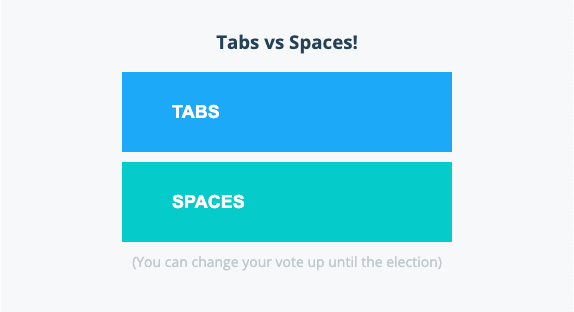

# Voting App

Simple voting app that consists of three services for highlighting running
containerized applications on Google Cloud.

- **web** - Web frontend (Python Flask app)
- **vote** - Vote API microservice (Node.js Express app)
- **database** - Backend (Postgres SQL database or Mongo NoSQL database)



If you prefer demo apps with more microservices and sophistication (but take a bit
longer to start), try these out:

 - https://github.com/GoogleCloudPlatform/microservices-demo
 - https://github.com/GoogleCloudPlatform/bank-of-anthos

## Quickstart (GKE with Autopilot)

### Prerequisites

- [Install Google Cloud SDK (gcloud)](https://cloud.google.com/sdk/docs/install)
- [Install Skaffold](https://skaffold.dev/docs/install/)

### Create an Autopilot cluster

With an Autopilot cluster, GKE manages compute infrastructure for Kubernetes,
freeing developers from physical cluster administration to focus on building and
maintaining applications.

You will need a Google Cloud project with billing enabled.

Follow either of the following instructions to create an Autopilot cluster:

- Command line instructions using [gcloud](./scripts/gcloud)
- Code sample using [Python](./scripts/python)

### Build and deploy the app

You will need to install Skaffold on your system. This tool uses a file
([./skaffold.yaml](./skaffold.yaml)) that configures the build and deploy tasks
for the application:

- Application components will be built on Google Cloud using Cloud Build so
  that you won't need to install any other tools, including Docker, on your 
  own system.
- The application will be deployed to the GKE Autopilot cluster you created 
  previously.


1. **Install Skaffold on your system**

Install [Skaffold for CLI](https://skaffold.dev/).

2. **Use scaffold to run the deployment**

Ensure the following environment variables are set:

- **PROJECT_ID** set to your project
- **REGION** set to the region
- **CLUSTER_ID** set to your cluster

```text
export PROJECT_ID=my-project
export REGION=region
export CLUSTER_ID=my-cluster
```

Get authorization to access your project.

```text
gcloud auth login
```

Get Kubernetes credentials for the GKE cluster in your project.

```text
gcloud container clusters get-credentials \
--project $PROJECT_ID \
--region $REGION \
$CLUSTER_ID
```

Run the following `skaffold` command. You may be prompted to enable various
APIs, such as Cloud Build.

```text
skaffold run --default-repo=gcr.io/$PROJECT_ID/voting-app --tail
```

## Test the app

Print the public address of the app.

```text
echo "http://"$(kubectl get service web-external -o jsonpath="{.status.loadBalancer.ingress[0].ip}{'\n'}")
```

- Cast votes at this address.
- Display voting results by appending `/tally/candidates` to the web address.

Skaffold displays streaming log output in the terminal.

> **Note:** you can also get the public address from the **External endpoints** field from this
> link (substituting values for `REGION`, `CLUSTER_ID` and `PROJECT_ID`)
> https://console.cloud.google.com/kubernetes/service/REGION/CLUSTER_ID/default/web-external/overview?project=PROJECT_ID

## Clean up

Press `Ctrl-C` to stop Skaffold log streaming.

To stop the voting app from running and to delete Kubernetes resources in the cluster, enter:

```text
skaffold delete
```
